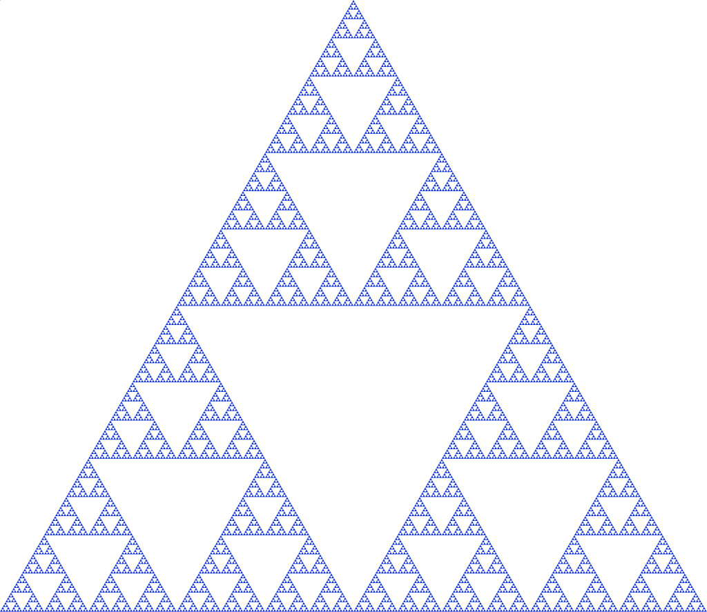

:Head: 
  <script src="https://ajax.googleapis.com/ajax/libs/jquery/3.2.1/jquery.min.js"></script>
  <link href="https://fonts.googleapis.com/css2?family=DM+Mono:wght@300;400;500&&display=swap" rel="stylesheet">
  <link href="https://fonts.googleapis.com/css2?family=Fira+Code:wght@400;500&display=swap" rel="stylesheet">
 <script type="text/javascript" async
    src="https://cdnjs.cloudflare.com/ajax/libs/mathjax/2.7.2/MathJax.js?config=TeX-MML-AM_CHTML"></script>
  <meta name="viewport" content="width=device-width, initial-scale=1.0">
  <meta charset="UTF-8">

  <link rel='stylesheet' href='include/atom-one-light.css'></link>
  <link rel='stylesheet' href='include/base.css'></link>
  <link rel='stylesheet' href='css/index.css'></link>

  <script src="include/highlight.js"></script>
  <script src='include/position-images.js'></script>
-Head-

# Generating fractals with complex "neural networks"
Date: May 18, 2020

Intro: Fractals like the [Mandelbrot Set](https://en.wikipedia.org/wiki/Mandelbrot_set) are traditionally defined by simple recursive functions. What if we initiated a random neural network and used that instead of a simple user-defined function?

## What is a fractal?
A fractal is a type of abstract geometric object that contains segments which are usually copies of the original. This property is known as self-similarity. One well known fractal which exhibits this behavior perfectly is the [Sierpinski triangle](https://en.wikipedia.org/wiki/Sierpi%C5%84ski_triangle).

Image: 

Fractals are also typically characterized by their "infinite detail", which means they can be zoomed into infinitely without any loss of intricacy. Fractals are known for their appearances in all kinds of places you wouldn't expect, including the coastlines of countries, the waves of oceans, and even in antenna design. One other interesting property of fractals is that they typically exhibit non-integer dimensionality, because of their self-similarity.

## The Mandelbrot set
The generation process of the Mandelbrot set is pretty simple. We start with a recursive function $z_{t + 1} = z_{t}^2 + c$. As our base case, $z_{0} = 0$. To plot the Mandelbrot set, each point on the complex coordinate plane is considered separately, and is the value of $c$. 

Image: 

For a quick refresher on the complex plane, $i$ is the imaginary number, and satisfies the property that $i^2 = -1$. Points on the complex plane are called complex numbers. To convert a real-valued coordinate to a complex number, you take the x-coordinate (the real part) and add it to the y-coordinate (the imaginary part) multiplied by $i$.

For example, the point (3, 2) in the real plane is $3 + 2i$. Complex numbers also have a magnitude, which is just their distance from the origin. It's very simple to compute--just convert the complex number back into a real point--and calculate its distance from the origin with $\sqrt{x^2 + y^2}$.

To generate the Mandelbrot set, we look at all points on the complex plane. For each of these points, we evaluate the recursive function, plugging in the point as $c$ and $0$ for $z_0$. We evaluate the recursive function for some number of iterations $t$, and at time $t$ we see if $z_{t}$ has a magnitude above some threshold. If it is above the threshold, we paint the point white, otherwise we paint it black. In other words, if the value of $z_{t}$ grows unbounded for a given $c$, the point on the complex plane $c$ is colored white, otherwise it is colored black. 

For the sake of realistic generation, we won't actually look at all points on the complex plane. Our view will be bounded, with both our imaginary and real axes typically within the range $[-1, 1]$ (there isn't much to see beyond that region).

## Fractal generation
Different equations yield different kinds of fractals, and there are all kinds of different things you can try. The point of this project is to use a randomly generated "neural network" as a function (as a disclaimer, it's not really a neural network, because it doesn't try to solve a particular task. However, it does share many of the same aspects, like matrix multiplication and non-linearities) rather than a hand crafted one. Basically, what we're doing is turning our function.

Equation: z_{t + 1} = z_{t}^2 + c
into
Equation: z_{t + 1} = f_{nn}(z, c)

where $f_{nn}$ is a neural network. The neural network I use in the code has two hidden layers each with 10 hidden nodes. The network has two inputs, one for $z_t$ and one for $c$. The output of the network is $z_{t + 1}$. The weights of the network are also complex numbers, with both the real and imaginary components of the weights initialized with a gaussian distribution. The threshold   I used was $0.8$, and I evaluated the neural network for 30 iterations. On my first attempt, I got a pretty cool looking photo!

Image: 

Way cooler than I expected. I then changed the program slightly so that instead of coloring a pixel black or white based on whether or not its value is greater than the threshold, it's colored based on how many iterations it took to exceed the threshold. This gets us an image that less grainy and shows how <i>quickly</i> a point grows unbounded.


The fractal looks different because network weights were initialized at random. I later started recording the seeds (unfortunately I was pretty disorganized while making this, and I don't really know if the seeds correspond to their original images 😕)

Image: 

## Specifics
I created three variables: $c, z, $ and a heatmap which I'll call $h$. $c$ and $z$ represent the variables of the recursive function mentioned before. The heatmap is the fractal image and is what is actually plotted. $c, z, h$ are parameterized by 5 values, which are $x_{min}, x_{max}, y_{min}, y_{max}, s$. The first four define the lower and upper bounds of the complex plane we'll plot, and $s$ represents the step, or resolution.

``` python 
import numpy as np
x = np.arange(x_min, x_max, s)
y = np.arange(x_min, x_max, s)

gx, gy = np.meshgrid(x, y)

c = (gx * 1j + gy).flatten()
z = np.zeros(len(c))    
h = np.zeros_like(z)   
```

Next I define my model using a set of weights and non-linearities. The weights are initialized by sampling small numbers from a zero-mean gaussian distribution for both the real and imaginary component. I created a number of models that produced interesting results, so I'll just show one of them here:

``` python
weight1 = 0.2 * randn(2, 10) * 1j + 0.2 * randn(2, 10) 
weight2 = 0.35 * randn(10, 10) * 1j + 0.35 * randn(10, 10)
weight3 = 0.45 * randn(10, 1) * 1j + 0.45 * randn(10, 1)

def model(inp):
    fc1 = (inp @ weight1) ** np.sqrt(2)
    fc2 = np.tan((fc1 @ weight2))
    fc3 = fc2 @ weight3

    return fc3
```

Since neural networks are basically just matrix multiplication, I don't have to loop through each of the values of $c$ and $z$ and compute the recursive function, I can do it all at once! Right now both $c$ and $z$ are flattened arrays of some length $L$. I add an extra dimension to both of them, making them shape $L \times 1$, then concatenate along the new axis to produce an array of shape $L \times 2$. Feeding this into the model produces an output of shape $L \times 1$. To convert this output back into a fully flattened array we just do some simple array slicing. Once the new $z$ array is calculated, I check whether each value of the array is greater than the threshold 0.8. This whole process is done in a for loop 30 times.

``` python
for iteration in range (30):
    c_ = np.expand_dims(c, -1)
    z_ = np.expand_dims(z, -1)

    inp = np.concatenate([c_, z_], axis = -1)

    # compute z{t + 1}
    z = model(inp)[:, 0]

    h += np.absolute(z) > 0.8
```

At the end $h$ is a heatmap showing which points went above the threshold the fastest. This can be directly plotted using matplotlib, or any other plotting library.

``` python
import matplotlib.pyplot as plt
plt.imshow(h)
plt.show()
```

## Gallery
Feel free to do whatever you want with these. You can view full resolution images at [the github repo]("https://github.com/nathan-yan/fractals/tree/master/fractals").

:Raw:
 <div style = 'display: flex; flex-wrap: wrap; margin-left: -2vw; width: 80vw'>
    <div style = 'width: 100vw; margin-left: -5vw; align-items:flex-end;'>
        
        
        
        
        
        
        
        
        
        
        
        
        
        
        
                
        
    </div>
</div>
-Raw-

:Raw:
<script>hljs.highlightAll();</script>
-Raw-


